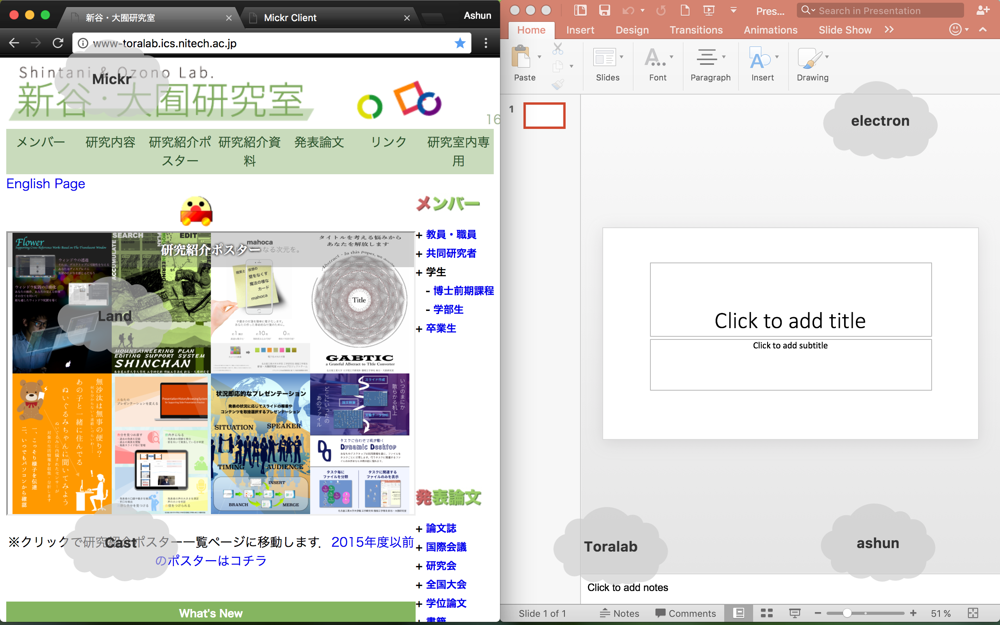

# Mickr API

electronを用いたMickrアプリケーション。全てのディスプレイの全てのワークスペースに最上面で透明なウィンドウを生成する。

## 開発環境と依存モジュール
* macOS sierra
* electron(1.6.8)
* Node.js(LTS 6.9.5)
* npm(3.10.10)
* [iohook](https://github.com/WilixLead/iohook)

## ディレクトリ構成

* main.js: Mainプロセス
* package.json
* lib: メニューバーに表示する画像
* modules:
  * Drive API: 工事中
  * node-telepathy-client: NodeJSでTelepathyClientを使用するためのモジュール
  * windowManager.js: 透明ウィンドウの作成
  * settingWindow.js: 接続設定画面の生成・削除
  * MickrClient.js: TelepathyClientの設定（あまり意味ない）
* public: レンダラープロセス
  * css
  * img
  * js
    * land.js: Mickr Landソースコード(Node.js)
    * cast.js: Mickr Castソースコード(Web)
    * web.js: Mickr Landソースコード(web)
    * MickrClient.js: Web上でTelepathyClientを使うためのモジュール
    * module.js: 雲の生成
  * lib
    * telepathy-client: Web上でTelepathyClientを使うためのライブラリ群
  * web
    * cast.html: Mickr Cast表示ページ(Web)
    * web-land.html: Mickr Landの表示ページ(Web)
  * land.html: Mickr Landの表示ページ(Node.js)
  * setting.html: Node.js時に接続先設定画面

## インストール手順
    git clone http://spring.ics.nitech.ac.jp:8081/git/ashun/Land.git
    npm install

## Mainプロセス
### MickrWindow
透明ウィンドウの作成。外部デバイス情報を取得し、全てのディスプレイと全てのワークスペースの斎場面にウィンドウを生成。

#### buildWindow(option)
ウィンドウの作成。
* option:
  * page: 表示するHTMLページ
  * x: x座標(left)
  * y: y座標(top)
  * width: ウィンドウサイズ(横)
  * height: ウィンドウサイズ(縦)

#### activateWindows()
透明ウィンドウを生成し、MickrClientが設定されていない場合、設定画面を生成する。設定画面の情報をもとにMickrClientオブジェクトを生成し、メッセージを取得できる状態にする。

#### createMainWindows()
全てのディスプレイに透明ウィンドウを生成する。

#### buildMainWindow(display)
* display: display型, electron.screenで取得したディスプレイ情報をもとに透明ウィンドウを生成。

#### removeWindow(display)
* display: display型, electron.screenで取得したディスプレイ情報をもとに透明ウィンドウを削除する。

#### getAllMainWindows()
* 生成済みの全ての透明ウィンドウを取得する。

#### getMainWindow()
現在アクティブなディスプレイに生成された透明ウィンドウを取得する。

#### getMainWindowWithMouse()
現在マウスが存在している位置に最も近い透明ウィンドウを取得する。

#### switchShowMode([mode])
* mode: boolean型, 透明ウィンドウのイベント透過モードの切替( true / false )。引数がない場合、現在のモードから切り替える。

## Rendererプロセス
一番単純な使い方

    // 雲を表示させる領域の生成
    var sky = new Sky();
    // 雲の追加
    var cloud = sky.addCloud({text: "もくもく",});

### Sky([option])
コンストラクタ。雲を表示させる領域の生成。

* option
  * elementID: String型, optional 雲を表示させたいDOM要素のid。引数がない場合は、自動でdiv要素`#sky`をHTMLのbody中に生成。
  * id: String型, optional MickrClientのid。設定されていない場合、ランダムな文字列。
  * site: String型, optional MickrClientのsite(接続先)。デフォルトでは"test"。
  * token: String型, optional MickrClientのtoken(パスワード)。デフォルトでは"Pad:9948"

**プロパティ**

* element: HTML DOM Element型 required HTML上の任意のdiv要素
* clouds: Array型 sky上に表示されるcloudオブジェクトの配列
* selected: Array型 クリックなどで選択されたcloudオブジェクト

#### addCroud([option])
雲の生成。addCroud時に雲が生成、追加され、Sky上に表示される。
* option: オブジェクト型, 雲の初期設定。プロパティの項目の設定。

#### appendCroud(cloud)
生成済みの雲の追加

* cloud: Cloudオブジェクト

    var cloud = new Cloud()
    sky.appendCloud(cloud)

### on(command, callback)

`command` を受けた際の処理

* `command`: String型, 必須, TelepathyサーバーのURL
* `callback`: Function型, `function () {}`, 必須, `command` を受けた際の処理

### send(option, callback)
* `option`
	* from: string 送信元
	*	to: string 送信先,
	* body: {
		* command: string コマンド,
		* content: optional メッセージ,
		* response: boolean レスポンスを求めるか
* `callback`: Function型, `function () {}`, 任意, 実行後の処理

### broadcast(option, callback)
* `option`
	* from: string 送信元
	*	to: string 送信先,
	* body: {
		* command: string コマンド,
		* content: optional メッセージ,
		* response: boolean レスポンスを求めるか
* `callback`: Function型, `function () {}`, 任意, 実行後の処理

### Cloud([option])
コンストラクタ。Sky上に表示する雲を生成する

**プロパティ**
* element: HTML DOM Element, 表示する雲を定義するDOM要素。typeがデフォルトの場合、雲のSVG要素を用いたDOMを動的に生成。
* rotation: boolean型, 自転する/しない( true / false )
* swing: boolean型, 浮遊する/しない( true / false )
* around: boolean型, 外周する/しない( true / false )
* visible: boolean型, 追加時に表示/非表示( true / false )
* position: Object型, 座標(num: x, num: y)
* type: String型, 表示する雲のタイプ( rect / custom / default [ cloud] )
* tags: Array型[ String ], タグ

#### createCloud([option])
雲の生成。Croudオブジェクトは、createCloud()を実行した段階で、Skyオブジェクトに追加される。option内でparentを指定することで、指定先のDOM要素に追加することも可能。
* option: オブジェクト型, 雲の初期設定。プロパティの項目の設定。

#### createCloudElement()
雲形のSVG要素を含むDOM要素を生成する。

#### setColor(string)
雲の色の設定・変更
* string: String型, 色の設定。CSSに準拠

#### setText(string)
雲中のテキストの設定・変更
* string: String型, 雲中のテキストの設定

#### setImage(url)
雲中のテキストの設定・変更
* url: String型, 画像データのurlもしくは文字列データ

#### setPosition(Object: {num: x, num: y})
雲の位置の設定・変更

#### setClickAnimation([function])
* function: function型, 雲をクリックした際のアニメーション等の設定。デフォルトでは、centering()を行う。

#### Around(start, dest, [])
外周させる
* start: Object型, 座標(num: x, num: y)
* end: Object型, 座標(num: x, num: y)

#### moveTo(position, [duration])
positionへ移動させる
* position: Object型, 座標(num: x, num: y)

#### goTo(string, [duration, rotation, swing, onComplete)
Top, Right, Down, Left: 画面の端まで移動させる
* string: String型, 上辺('Top'), 右辺('Right'), 下辺('Down'), 左辺('Left')のいづれかの方向。

#### rotate(angle, [duration])
回転させる
* angle: int型, 角度(度数法)

#### fadeIn([duration, alpha])
フェードイン

#### fadeOut([duration])
フェードアウト
